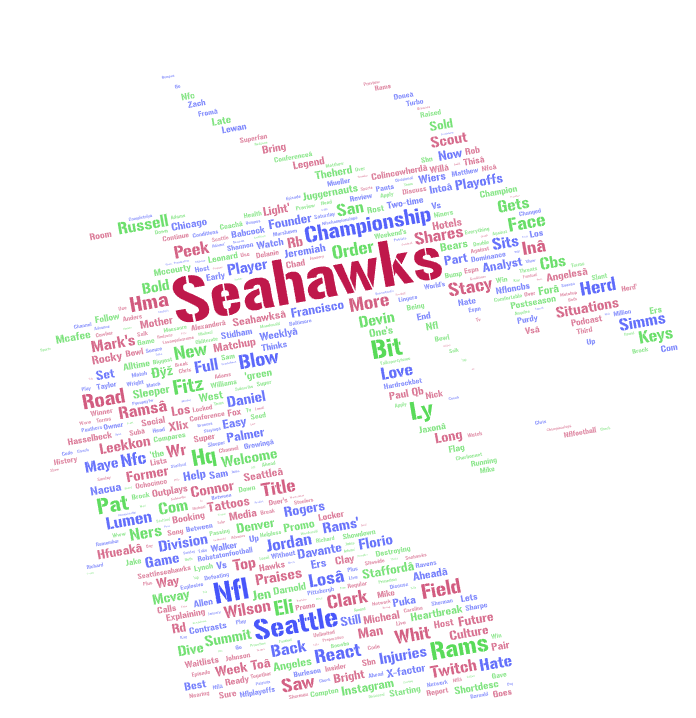

# GEOG 458 – Lab 2: YouTube Word Cloud Analysis

## Topic Overview
This project explores how YouTube users discuss two NFL teams, the **Seattle Seahawks** and the **San Francisco 49ers**, by collecting and analyzing YouTube search results using automated web scripting. The goal is to understand differences and similarities in online discourse surrounding both these teams through word cloud visualization.

## Search Parameters
Data was collected using the provided `youtube.ipynb` script on Google Colab. Two separate searches were conducted:

- **Search Term 1:** "Seahawks"
- **Search Term 2:** "49ers"

For each search term, YouTube search result pages were crawled, and metadata such as video titles and short descriptions were extracted and saved as CSV files.

The resulting datasets are available here:
- [Seahawks CSV](assests/seahawks_.csv)
- [49ers CSV](assets/49ers_.csv)

## Motivation for Comparison
The Seahawks and 49ers are long-standing rivals within the NFC West (since 2002), making them a great comparison for examining how fan engagement, media narratives, and market size differ between two popular teams. Comparing these teams helps reveal how sports fandom manifests differently in online video content.

## Word Cloud Results

### Seattle Seahawks Word Cloud

The Seahawks word cloud emphasizes terms such as **Seattle**, **NFL**, **Championship**, **Player**, **Wilson**, and **Field**. This suggests a strong focus on team identity, past success, and individual player performance. Emotional and celebratory language appears frequently, which indicates strong fan engagement.

### San Francisco 49ers Word Cloud

The 49ers word cloud prominently features **Niners**, **San Francisco**, **NFL**, **Coach**, **Offense**, and **Draft**. Compared to the Seahawks, this cloud appears more strategy-oriented, with frequent references to coaching decisions, roster changes, and team rebuilding situations.

*Note:* In the 49ers word cloud, the term “Ers” originally appeared due to tokenization of the team name “49ers.” This label was manually changed to “Niners” in the visualization to improve clarity and avoid confusion for people looking at the word cloud.

## Comparison and Discussion
Both word clouds share common football-related terms such as **NFL**, **Team**, and **Game**, reflecting how both teams are part of the same league. However, the Seahawks cloud leans more toward emotional and legacy-based language, while the 49ers cloud highlights organizational and tactical discussion.

These differences may reflect team performance cycles, media narratives, or fan expectations at the time of data collection.

## Possible Explanations
Several factors could explain these observed patterns:
- Recent performance differences between teams.
- Media coverage focusing on coaching or roster changes.
- Fan base size and engagement styles.
- Algorithmic amplification of certain video topics on YouTube.

## Future Improvements
This research could be improved by:
- Increasing the number of search terms, like adding player names or recent games.
- Collecting data over multiple time periods.
- Applying geographic filters.

## Reflection
Before conducting this analysis, I expected both teams to show similar discourse patterns. However, the contrast between the emotionally driven Seahawks content and strategically focused 49ers content stood out during the analysis. This highlights how digital platforms can reflect differences in sports culture and fan engagement.
